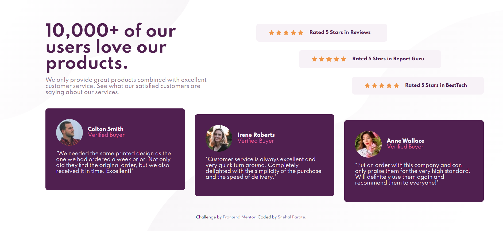

# Frontend Mentor - Social proof section solution

This is a solution to the [Social proof section challenge on Frontend Mentor](https://www.frontendmentor.io/challenges/social-proof-section-6e0qTv_bA). Frontend Mentor challenges help you improve your coding skills by building realistic projects. 

## Table of contents

- [Overview](#overview)
  - [The challenge](#the-challenge)
  - [Screenshot](#screenshot)
  - [Links](#links)
- [My process](#my-process)
  - [Built with](#built-with)
  - [What I learned](#what-i-learned)
  - [Continued development](#continued-development)
  - [Useful resources](#useful-resources)
- [Author](#author)
- [Acknowledgments](#acknowledgments)

## Overview

### The challenge

Users should be able to:

- View the optimal layout for the section depending on their device's screen size

### Screenshot

Desktop view of the application:




### Links

- Solution URL: [Solution URL here](https://github.com/snehal1791/social-proof-section-master)
- Live Site URL: [Live site URL here](https://snehal1791.github.io/social-proof-section-master/)

## My process

### Built with

- Semantic HTML5 markup
- CSS custom properties
- Flexbox
- CSS Grid
- Mobile-first workflow

### What I learned

With this challenge I learned and implemented 
- CSS-Grid, Flexbox, specifically that an element can be made a grid container with `display: grid` and all of its direct children will automatically be laid out as grid items. I liked the shorthands for some of the properties of grid like combining `align-items: center ` and `justify-items: center` into `place-items: center`.
- Ability to name grids using `grid-template-areas` property and then place items in the names area using `grid-area`

  ```css
  body {
        background-image: url('./images/bg-pattern-top-desktop.svg'), url('./images/bg-pattern-bottom-desktop.svg');
        background-position: top left, bottom right;
        background-repeat: no-repeat;
        display: grid;
        grid-template-columns: 1fr 1fr;
        grid-template-rows: 40% 50% 10%;
        grid-template-areas:
            "header aside"
            "main main"
            "footer footer";
        gap: 30px;
        padding: 4rem;
        text-align: left;
    }

    .header-content {
        grid-area: header;
        display: flex;
        flex-direction: column;
        justify-content: left;
        padding: 0 5rem;
    }

    .header-text {
        flex: 1;
    }

    .aside-content {
        grid-area: aside;
        display: grid;
        grid-template-columns: 1fr;
        grid-template-rows: repeat(3, 1fr);
        gap: 10px;
        place-items: center;
    }

    .rating {
        max-width: 45rem;
        align-self: center;
        display: flex;
        align-items: center;
        align-content: center;
        padding: 5px 35px;
        justify-content: center;
    }

    .rating:first-of-type {
        justify-self: flex-start;
    }

    .rating:last-of-type {
        justify-self: flex-end;
    }

    .rated {
        font-size: 0.85rem;
        font-weight: 800;
        color: var(--very-dark-magenta);
        margin-left: 15px;
        margin-right: 15px;
        align-self: center;
    }

    .main-reviews-content {
        grid-area: main;
        display: grid;
        grid-template-columns: 1fr 1fr 1fr;
        grid-template-rows: 1fr;
        gap: 30px;
        place-items: center;
        padding-left: 5rem;
    }

    .review {
        align-self: center;
    }

    .review:first-of-type {
        align-self: flex-start;
    }

    .review:last-of-type {
        align-self: flex-end;
    }

    .user-details {
        display: flex;
    }

    .user-demograph {
        align-self: center;
        justify-self: center;
    }

    .attribution {
        grid-area: footer;
    }
  ```

### Continued development

I would continue to improve my current skills on CSS-Grid, Flexbox and combining these two together to achive responsiveness. I would like to learn CSS pre-processor, such as Sass, Less or Stylus.

### Useful resources

- [AlgoExper](https://www.algoexpert.io/frontend/css-crash-course/css-grid) - I am enrolled under FrontEnd course. They have a section for CSS-Grid for 20mins explaining with example very well. I really liked this short tutorial.
- [CSS Grid](https://css-tricks.com/snippets/css/complete-guide-grid/) - This helped me for understanding CSS Grid.


## Author

- Website - [Snehal Parate](https://snehal1791.github.io/portfolio/)
- Frontend Mentor - [@snehal1791](https://www.frontendmentor.io/profile/snehal1791)
- Twitter - [@sne_hal_p](https://twitter.com/sne_hal_p)


## Acknowledgments

I was inspired by [Kevin Powell's](https://www.youtube.com/watch?v=K27WULzr2P8&ab_channel=KevinPowell) solution.
Their solutions help me better understand how to structure HTML CSS
